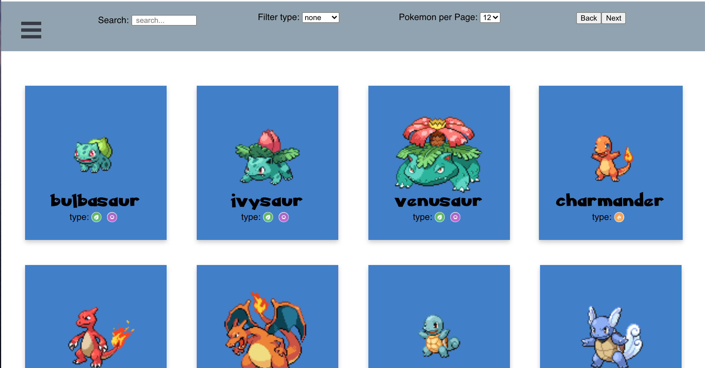
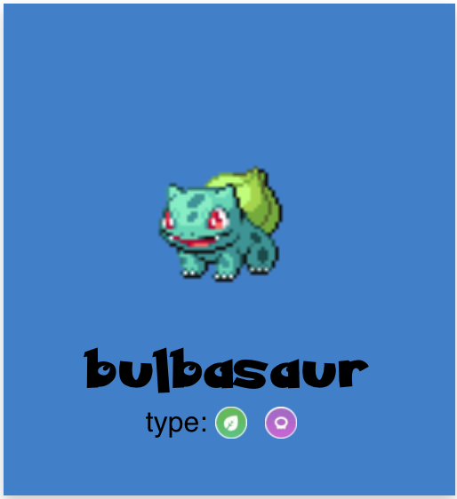
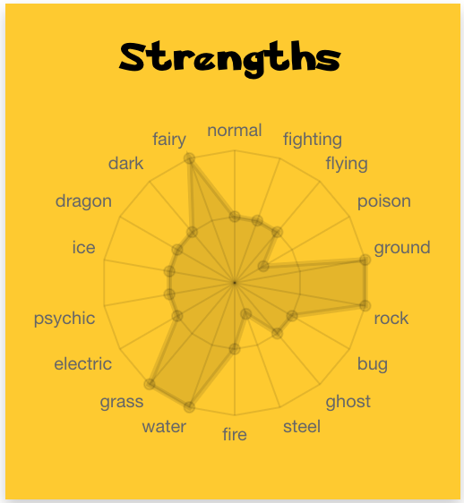
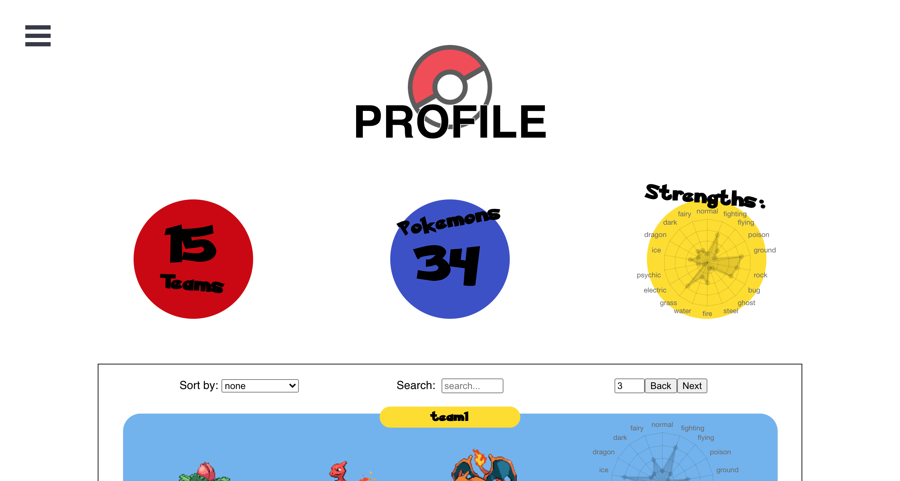
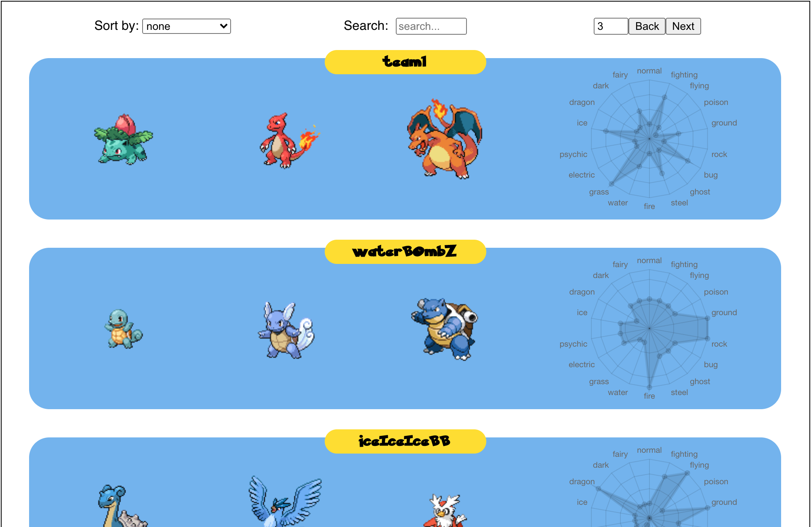
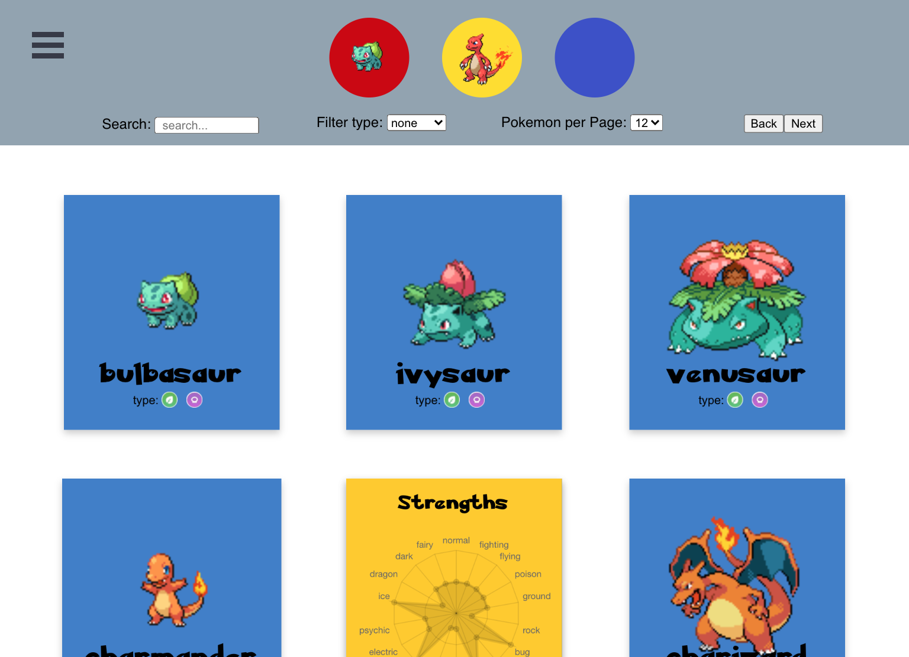

# Pokemon Teams

**Overview:**  
A responsive web app which users can create pokemon teams according to their strengths. The main use of this is to build teams that will target specific weaknesses of opposing teams.

**Table of Contents:** 
- Pages and Components Overview
- Technologies/Tools used in project
- How to run
- Improvements for future

**Mockup Presentation:** 
https://docs.google.com/presentation/d/13u7kDctgJgnW38JNj-4PahGmpf8U9fS1aeLRMG5-pRA/edit?usp=sharing

# Pages and Components
- **Catalogue Page:** user can browse/search/filter through catalogue of 910 Pokemons

 

---

 - **Pokemon Card Component:** flip card that shows pokemon name and type on one side and strength radar on the other 
 
  | | 
|--|--|

 ---
 - **Profile Page:** user can see number of teams, number of pokemons, combination of strength radars for the teams and team table from this page. User can add team with button at the bottom

 

---

 - **Team Table:** user can browse/search/sort through the teams and team's total strength radar

 

 ---

 - **Add Team:** user can browse/search/sort through the catalogue and add pokemon to their team. Each added pokemon can be viewed up top.

---

# Technologies and Tools
- React
- Styled Components
- Chart.js
- React-burger-menu
- React-Flippy
- React Router Dom
- React-Responsive
- Axios
- Express
- Morgan 
- MySQL
- CORS
- Body Parser

# How to Run
1. Make sure there is SQL table created locally and replace authentification on index.js
2. Make tables locally with specified columns
3. Create to two terminals for backend and frontend folders
4. Run npm start in frontend terminal
5. Run nodemon index.js for backend terminal
6. App now accessible on localhost:3000

# Improvements for the Future
1. Bootstrap frontend to streamline design
2. Write caches to check API and update it every week to improve runtime. Caches to write: catalogue, strength index, and pokemon database. 
3. Write database qeury function so same code is not repeated multiple times in backend.
4. Security library for sign in queries to ensure security
5. Set up environment for database credentials for security and launching purposes

